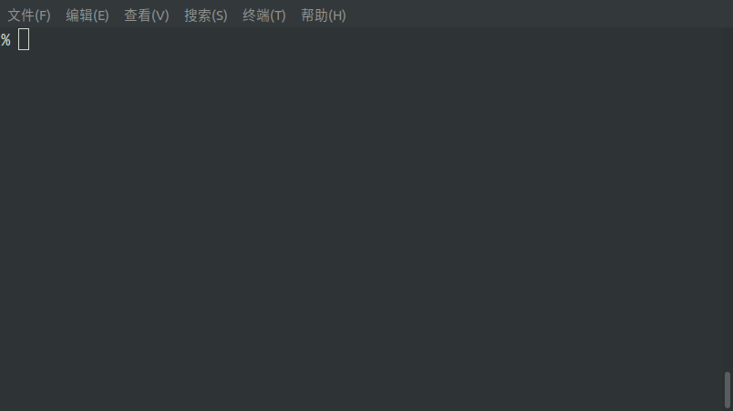
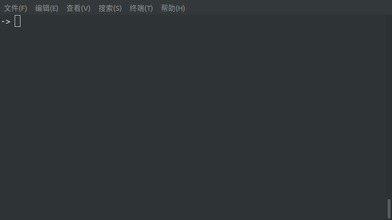

TShell
======
This is a toy shell, so it's called `TShell`.

## 1 安装

### 1.1 准备

- 环境
    - 系统: `Ubuntu 18.04.1` （注：Linux 发行版应该都可以）
    - 构建工具：`cmake 3.14.2`
- 第三方依赖 `readline`
    - 官网：[GNU readline](https://tiswww.case.edu/php/chet/readline/rltop.html) 
    - 安装方式：`sudo apt-get install libreadline-dev`

### 1.2 编译

- 第一步
    - 在工程根目录执行：`cmake CMakeLists.txt`
- 第二步
    - 第一步成功后，再在工程根目录执行：`make`

上面两个步骤执行成功后，你会看到在工程根目录里面多了一个可执行文件：`TShell` 此时已经大功告成。接下来不妨玩玩 `TShell`，通过 `./TShell` 打开它。

## 2 基本使用

### 2.1 支持的功能

- 设置环境变量
- 动态修改命令提示符
- 输入、输出重定向
- 作业控制
- 历史命令 & Tab补全
- 退出

### 2.2 各功能详细介绍

#### 2.2.1 设置环境变量

`export` 作为 TShell 的内部命令，提供一些操作环境变量的功能。

- 用法：`export export [-gn] [名称[=值] ...] 或 export -p`
- 说明：
     - `export -g [名称 ...]`   查询指定名称对应的值，一次可查询多个
     - `export -d [名称 ...]`   删除指定名称的环境变量，一次可删除多个
     - `export -p`              显示所有环境变量
     - `export [名称[=值] ...]`  添加环境变量

#### 2.2.2 动态修改命令提示符

TShell 支持动态修改命令提示符。

在使用 TShell 过程中只需要把 `CMD_SYM` 环境变量修改为想要设定的命令提示符即可完成修改。

以下演示将命令提示符从 `->` 修改为 `%`：

#### 2.2.3 输入、输出重定向

`>` `<` `>>` 为 TShell 的重定向标识符。

使用说明：
1. 重定向标识符说明
    - `>`   用作输出重定向（默认为标准输出）
    - `<`   用作输入重定向
    - `>>`  用作追加重定向（默认为标准输出追加）
2. TShell 中重定向标识符前的 `0` `1` `2` 有特殊含义：
    - `0`   标准输入
    - `1`   标准输出
    - `2`   标准错误
3. TShell 中重定向标识符后的 "&0" "&1" "&2" 有特殊含义：
    - "&0"  引用 `fd0`
    - "&1"  引用 `fd1`
    - "&2"  引用 `fd2`
4. 注意：在使用重定向时需要用空白字符划分，这是与标准 shell 不同的
    - `ls > a 2 > &1` -->  正确
    - `ls >a`         -->  错误，此处把 `>a` 作为一个文件
    - `ls > a 2>&1`   -->  错误， `2>&1` 应写为 `2 > &1`（标准错误重定向）
    - [注] 该设计造成 0 1 2 做命令参数时需要加 '' 单引号:
         - `ls '2' > a.txt` -->  2 不表示标准错误重定向，而作为 ls 的一个参数

以下为一个简单的演示案例：

#### 2.2.4 作业控制

TShell 提供作业控制功能，支持的命令有：`jobs` `fg` `bg`。

使用说明：

1. `jobs`
    - Usage: `jobs [-rs]`
    - 作用: 查看后台运行作业的状态。
    - 选项: 其中，选项 r 列出所有正在运行中的; 选项 s 列出所有正停止的
2. `fg`
    - Usage: `fg 作业标号`
    - 作用: 将指定后台作业切换至前台运行
3. `bg`
    - Usage: `bg 作业标号`
    - 作用: 继续在后台运行已停止的作业
4. 其他
    - 可以通过 `ctrl+z` 组合键将正在执行前台作业暂停并置于后台

以下为一个简单的演示案例：

#### 2.2.5 历史命令 & Tab补全

TShell 支持历史命令：
- 支持使用 `↑` or `↓` 上翻 或 下翻 已输入的命令；
- 支持使用 `ctrl+r` 查阅历史命令。

TShell 支持 Tab补全：
- 在命令行输入的第一个单词下，按 `Tab` 将补全命令；
- 在其他情况下将补全本地文件夹下的文件；

以下为一个简单的演示案例：

#### 2.2.6 退出

TShell 支持使用 `exit` or `ctrl+c` 退出。如下：

