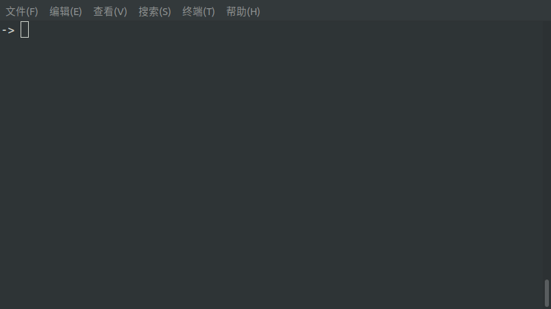
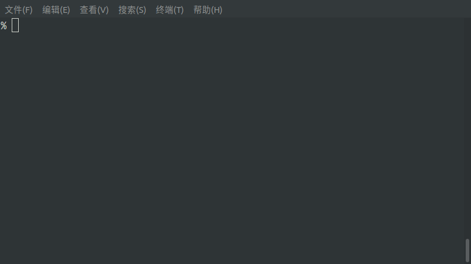

# TShell

## 1. 需求分析

1. **Shell** 启动后显示一个命令提示符(例如 `->`)。用户可以通过给特定的环境变量赋值来改变命令提示符的形式；
2. 提供输入、输出重定向；
3. 提供作业控制；
4. 提供历史命令查询以及 `Tab` 命令补全；
6. 通过某个特殊的命令或按键组合可以正常地关闭本程序。

## 2. 详细设计

### 2.1 综述

**Shell 可执行的命令主要分两类：**
1. 内部命令
    - 程序内实现的命令，绝大部分需求需要这些内部命令实现；
    - TShell 支持的内部命令
      1. `export`
	 2. `<` `>` `>>`
	 3.  `jobs` `fg` `bg`
	 4.  `exit`
2. 外部命令
    - 使用 `fork` + `exec` 执行外部命令。

### 2.2 程序结构
```
.
├── CMakeLists.txt
├── cmd
│   ├── CMakeLists.txt
│   ├── cmd_export.c
│   ├── cmd_jobs.c
│   └── cmd_redirect.c
├── shell.c
├── shell.h
└── util
    ├── CMakeLists.txt
    ├── prefix_tree.c
    ├── prefix_tree.h
    ├── sem_op.c
    ├── sem_op.h
    ├── str_op.c
    └── str_op.h
```

### 2.3 功能设计
1. 命令提示符
    - 指定 `CMD_SYM` 环境变量用于改变命令提示符的形式；
    - 为了实现动态改变命令提示符，在每次等待用户输入新的命令行前查询上述环境变量是否改变；
    - 为了方便测试，提供内部 `export` 命令：用于修改环境变量。 
2. 输入输出重定向
    - 指定 `<` `>` `>>` 作为重定向标识符；
    - 重定向的具体实现依赖 `dup2`；
    - 每次执行完“命令”后恢复 **shell进程** 的标准输入、输出；
    - 实现支持内部命令的重定向。
3. 作业控制
    - shell 进程与执行命令的进程在不同的进程组；
    - 前台作业挂起：按 `ctrl+z` 后前台作业状态发生变化，shell 进程收到 `SIGCHLD` 信号，可在该信号处理程序中实现前台作业挂起，将自己设为前台进程组；
    - 后台停止作业恢复后台运行：shell 进程向其发送 `SIGCONT` 信号；
    - 后台作业切换至前台运行：先将后台作业设为前台进程组，再向其发送 `SIGCONT` 信号；
    	- 注意：在上述切换过程中需要屏蔽某些信号(如 `SIGCHLD` )，以免被打断。
    - 后台作业的监控全部使用非阻塞的 `waitpid`。
4. 历史命令 & Tab补全
    - 依赖 `readline` 库；
    - 设计使用 `前缀树` 保存所有的命令名。
5. 退出
    - 指定内部命令 `exit` 用于退出；
    - 亦设计 `ctrl+c`(即 `SIGINT` 信号)用于退出。


## 3. 测试报告

- 命令提示符

- 输入、输出重定向

- 作业控制

- 历史命令 & Tab补全

- 退出 exit


## 4. 总结

1. 未详细阅读函数的说明就开始用，然后 **跳入一个一个的坑，最终还是靠说明文档爬出来的！**
2. 未实现管道；

